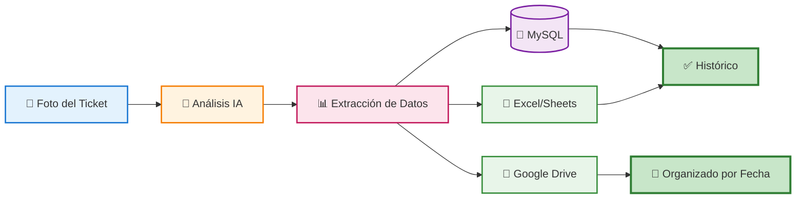

# 🎬 Demo del Analizador de Tickets

## Flujo de Trabajo Visual



## Proceso Paso a Paso

### 1️⃣ Entrada: Foto del Ticket
El usuario sube una imagen de un ticket o factura a Google Drive (carpeta "Sin Clasificar").

**Datos del ticket de ejemplo:**
- 🏢 Empresa: Supermercado Central
- 📅 Fecha: 15/01/2025
- 💰 Total: €45.80
- 📊 IVA (21%): €7.89

### 2️⃣ Procesamiento: IA Extrae los Datos
El modelo de visión (OpenAI/Gemini) analiza la imagen y extrae:

```json
{
  "empresa": "Supermercado Central",
  "fecha": "2025-01-15",
  "importe": 45.80,
  "iva": 7.89,
  "archivo_url": "https://drive.google.com/file/d/..."
}
```

### 3️⃣ Almacenamiento: Base de Datos MySQL
Los datos se guardan en la tabla `tickets`:

| ID | Empresa | Fecha | Importe | IVA | Archivo URL | Created At |
|----|---------|-------|---------|-----|-------------|------------|
| 1 | Supermercado Central | 2025-01-15 | 45.80 | 7.89 | https://... | 2025-01-15 10:30:00 |

### 4️⃣ Exportación: Excel/Google Sheets
Se añade una nueva fila automáticamente a la hoja de cálculo:

| Empresa | Fecha | Total | IVA | Link |
|---------|-------|-------|-----|------|
| Supermercado Central | 15/01/2025 | €45.80 | €7.89 | [Ver](https://...) |

### 5️⃣ Organización: Google Drive
El archivo se mueve automáticamente a:
```
📁 Tickets Clasificados/
  └── 📁 2025/
      └── 📁 Enero/
          └── 📄 ticket_20250115_supermercado.jpg
```

### 6️⃣ Verificación: Detección de Duplicados
Si se intenta procesar el mismo ticket dos veces, el sistema:
- ✅ Detecta el duplicado comparando con la base de datos
- ⚠️ Envía una notificación por email
- 🚫 No crea un registro duplicado

## Características Destacadas

### 🔒 Seguridad
- Conexión HTTPS con certificados SSL (Let's Encrypt)
- Credenciales almacenadas de forma segura en n8n
- Backups automáticos del sistema completo

### ⚡ Automatización
- Proceso 100% automático (sin intervención manual)
- Detección de nuevos archivos en tiempo real
- Organización inteligente por fecha

### 📊 Trazabilidad
- Historial completo en base de datos
- Enlaces directos a los archivos originales
- Registro de timestamps para auditoría

## Tecnologías Utilizadas

- **n8n**: Orquestación del workflow
- **Docker**: Contenedorización y despliegue
- **MySQL**: Base de datos relacional
- **OpenAI/Gemini**: Modelos de visión para OCR inteligente
- **Google Drive API**: Almacenamiento y organización
- **Google Sheets API**: Reportes en tiempo real
- **Let's Encrypt**: Certificados SSL automáticos

---

💡 **Nota**: Este es un proyecto real desplegado en producción en un VPS con Docker.
