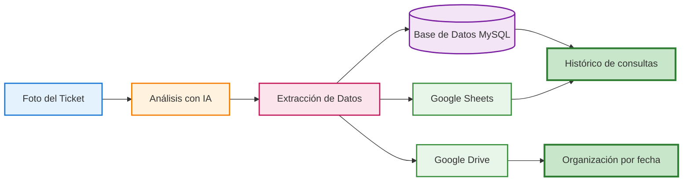

# Demo del Analizador de Tickets

## Flujo de Trabajo

El siguiente diagrama muestra el recorrido que sigue un ticket desde que se recibe hasta que queda archivado y registrado:



## Detalle del proceso

### 1. Entrada: Foto del Ticket
El usuario sube una imagen de un ticket o factura a Google Drive para iniciar el proceso.

**Datos del ticket de ejemplo:**
- Empresa: Supermercado Central
- Fecha: 15/01/2025
- Total: 45.80€
- IVA (21%): 7.89€

### 2. Procesamiento con IA
n8n captura la imagen y utiliza un modelo de IA para extraer la información necesaria. El resultado es un objeto con los datos limpios y listos para procesar:

```json
{
  "empresa": "Supermercado Central",
  "fecha": "2025-01-15",
  "importe": 45.80,
  "iva": 7.89,
  "archivo_url": "https://drive.google.com/file/d/..."
}
```

### 3. Almacenamiento: Base de Datos MySQL
Los datos se guardan de forma persistente en la tabla de registros:

| ID | Empresa | Fecha | Importe | IVA | Archivo URL | Fecha Registro |
|----|---------|-------|---------|-----|-------------|----------------|
| 1 | Supermercado Central | 2025-01-15 | 45.80 | 7.89 | https://... | 2025-01-15 10:30:00 |

### 4. Exportación: Excel / Google Sheets
Se añade una nueva fila automáticamente a la hoja de cálculo para su revisión visual:

| Empresa | Fecha | Total | IVA | Enlace |
|---------|-------|-------|-----|--------|
| Supermercado Central | 15/01/2025 | 45.80€ | 7.89€ | [Ver archivo](https://...) |

### 5. Organización: Google Drive
El archivo original se mueve automáticamente a una estructura de carpetas lógica:

```
Tickets Clasificados/
  └── 2025/
      └── Enero/
          └── ticket_20250115_supermercado.jpg
```

### 6. Verificación: Detección de Duplicados
Si se intenta procesar el mismo ticket dos veces, el sistema ejecuta las siguientes acciones:
- Detecta el duplicado comparando el identificador único con la base de datos.
- Envía una notificación por correo electrónico avisando del error.
- Interrumpe el flujo para no crear registros repetidos.

## Aspectos técnicos relevantes

### Seguridad y Disponibilidad
- Tráfico cifrado mediante certificados SSL.
- Gestión segura de credenciales dentro del entorno de n8n.
- Copias de seguridad automáticas para evitar pérdida de datos.

### Automatización inteligente
El flujo no depende de coordenadas fijas en el ticket; la inteligencia artificial es capaz de identificar los datos sea cual sea el formato de la factura. Además, la organización en carpetas es dinámica y se adapta a las fechas que detecta en el documento.

## Tecnologías utilizadas
En este proyecto se han integrado las siguientes herramientas:
- n8n para la orquestación de todas las tareas.
- Docker para el despliegue en servidor.
- MySQL para el almacenamiento de datos.
- Modelos de visión de OpenAI o Gemini para el análisis de imagen.
- APIs de Google Drive y Google Sheets para la gestión de archivos y reportes.
- Let's Encrypt para la seguridad del servidor.

Este sistema está actualmente en funcionamiento comercial en un servidor VPS, procesando documentos de forma totalmente autónoma.
